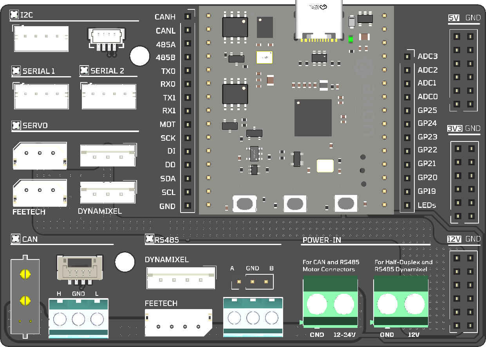

# link101 Hardware

link101 is a multi-protocol USB interface board. One Type-C cable gives you CAN-FD, RS485, Dynamixel, Feetech, UART, I2C, and MIT Cheetah-protocol ports, all as stable Linux devices.

## Architecture

The LINK101 system consists of two boards:

- **link101** — The core module. RP2350-based controller in a 39.2×36.6mm form factor with 2× 1×15 pin headers.
- **link101_carrier** — The breakout carrier board. Exposes every bus as physical connectors, adds onboard sensors, neopixel indicators, and a 5V buck regulator.

## Boards

### link101 (Module)

The brains of the system. A Raspberry Pi RP2354A (dual Cortex-M33 at 150 MHz, 520 KB SRAM, 2 MB flash) with onboard peripherals:

| Feature | Detail |
|---|---|
| **USB** | USB Type-C composite device (CDC serial, SocketCAN, debug) |
| **CAN** | MCP2518FD CAN-FD controller + SN65HVD230 transceiver |
| **RS485** | SP3485EN half-duplex transceiver with DE control |
| **GPIO** | 7× GPIO, 4× ADC exposed via pin headers |
| **I2C** | Hardware I2C bus (SCL/SDA) |
| **SPI** | Hardware SPI (MOSI/MISO/SCK) |
| **UART** | 2× full-duplex UART (UART0, UART1) |
| **NeoPixel** | WS2812B-compatible output |
| **Power** | VBUS input, onboard 3.3V LDO (AP2112K-3.3), 1.1V core supply |
| **Protection** | ESD protection on CAN (PESD1CAN), USB (USBLC6-2SC6), and RS485 (PRTR5V0U2X) |
| **Debug** | SWD header, USB boot select |

**Files:** `link101.kicad_pro` (project), `link101.kicad_sch` (schematic), `link101.kicad_pcb` (layout), `link101_Module.kicad_sym` (symbol), `link101_Module.kicad_mod` (footprint)

### link101_carrier (Carrier Board)

Breaks out every signal from the module into real-world connectors, adds sensors, neopixel status LEDs, and power regulation:

| Section | Details |
|---|---|
| **Power** | XT30 input → LMR16006 5V buck regulator → SS54 reverse protection → servo power rail |
| **CAN-FD** | Screw terminals, MCP2518FD via module SPI |
| **RS485** | Screw terminals, hardware UART with DE pin |
| **UART0** | 5V-level full-duplex serial (XH2.54 connector) |
| **UART1** | 3.3V-level full-duplex serial (2.54mm pin header) |
| **Half-Duplex UART** | Feetech SCS/STS, Dynamixel Protocol 1.0/2.0, FashionStar bus servos (XH2.54 + Dynamixel connectors) |
| **I2C** | Qwiic/STEMMA QT connector (JST-GH 4-pin) |
| **SPI** | 2.54mm pin header |
| **MIT Cheetah** | XT30(2+2) connector for Damiao, CubeMars, Unitree, MyActuator |
| **ODrive** | JST-GH 4-pin connector |
| **IMU** | Onboard LSM6DSOX 6-axis IMU + MMC5983MA magnetometer via SPI |
| **NeoPixels** | WS2812B ×4 — one per bus (CAN, RS485, serial, servo) |
| **GPIO/ADC** | 7× GPIO + 4× ADC breakout pin headers |

**Files:** `link101_carrier.kicad_pro` (project), `link101_carrier.kicad_sch` (schematic), `link101_carrier.kicad_pcb` (layout)

